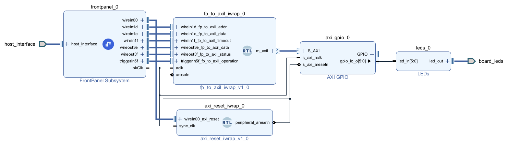

# FrontPanel to AXI-Lite Bridge

This library offers an AXI-Lite master interface via FrontPanel.

*This is the result of executing the `vivado_exdes_builder.tcl` file, and shows the resulting example design in the IPI block designer.*

Features:
- C++ and Python APIs are provided to communicate with the underlying gateware controller through FrontPanel endpoints.
- Our provided example design build script can generate bitstreams for ALL of our USB3 FrontPanel-enabled AMD FPGA modules.
- Example applications in both C++ and Python, designed to work with the above bitstream, demonstrate each API method/function.
- A Cocotb testbench is included with the gateware.
- Documentation: C++ (Doxygen) and Python (Google's Docstrings). Generate with Doxygen and PyDocs respectively.

## Getting Started:

### Prerequisites:
- [Opal Kelly's USB3-Enabled AMD FPGA Modules](https://opalkelly.com/products/)
- [FrontPanel SDK](https://docs.opalkelly.com/fpsdk/getting-started/)
- [FrontPanel Subsystem Vivado IP Core](https://docs.opalkelly.com/fpsdk/frontpanel-hdl/vivado-ip-core/)
- [Vivado Board File](https://docs.opalkelly.com/fpsdk/frontpanel-hdl/vivado-board-files)

### Steps:
1. **Build the Gateware to Bitfile:** For building the bitfile, refer to the instructions in [gateware/vivado_exdes_builder.tcl](gateware/vivado_exdes_builder.tcl).
   - We provide a prebuilt bitfile for the XEM8320-AU25P, which is located in the GitHub releases.
2. **Running the Application:**
   
   - **For C++:** 
     - A prebuilt Windows executable can be found in the GitHub Releases section.
     - For building and running the C++ code, refer to the instructions in [cpp_api/example.cpp](cpp_api/example.cpp).
     
   - **For Python:** 
     - For running the Python code, refer to the instructions in [python_api/example.py](python_api/example.py).
       
## Documentation Generation:

### C++ API:
1. Get [Doxygen](https://github.com/doxygen/doxygen).
2. Run `doxygen -g && doxygen`.

### Python API:
The Python API can be visualized with Python's built-in PyDoc.
1. Run `py -m pydoc -w FrontPanelToAxiLiteBridge`.
